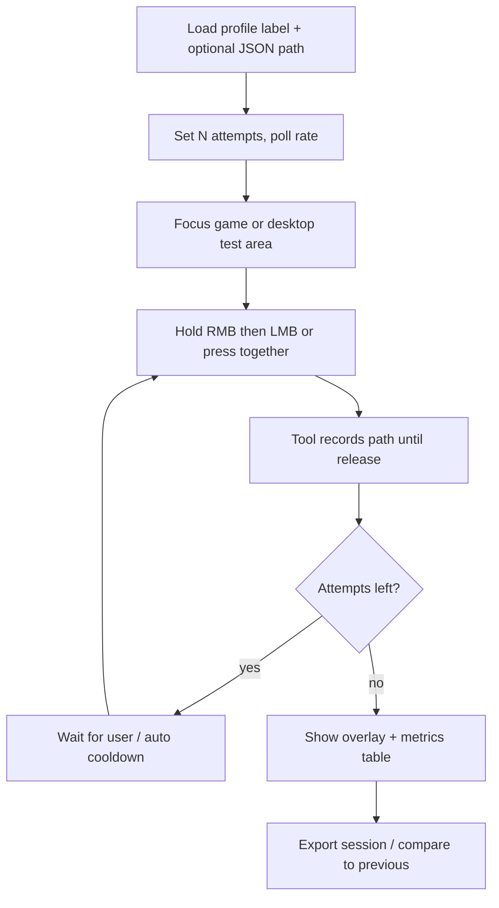
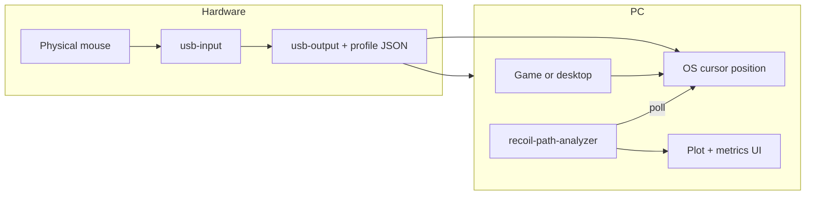

# Recoil Path Analyzer — Project Plan

Plan for a **new, PC-side tool** (separate from `usb-input` / `usb-output` firmware) that records the **on-screen cursor path** during macro spray tests and compares **multiple attempts** visually and numerically. Used to tune `usb-output/profiles/*.json` and validate recoil consistency work (IMP-1..9, `debugMode`, `humanize`, etc.).

**Status:** Planning only — no implementation in this document.

---

## 1. Problem statement

Today, “consistent recoil” is judged by eye in-game. That is slow and noisy:

- Hard to see **small X drift** vs stable Y when patterns look “about right.”
- No record of **run-to-run spread** for the same profile and trigger.
- Firmware logs (`USB_OUTPUT_PERF_LOG`, serial step timing) do not show the **final cursor path** the OS/game applies.

**Goal:** After N spray attempts with the **same JSON profile** and the **same trigger chord**, answer:

1. Do paths **overlap** (good) or **fan out** (bad)?
2. Where do they diverge — start, mid-spray, end, mostly **horizontal**?
3. Are metrics stable enough to accept a profile change or firmware change?

---

## 2. Scope

### In scope (v1)

| Item | Description |
|------|-------------|
| **Trigger** | Start recording when **LMB + RMB are both down** (mouse mask `b: 3`, same as Rust ADS in e.g. `rust-ak-smooth-v3.json`). Stop when **either** button is released. |
| **Capture** | Poll or hook **global cursor position** (`x`, `y` in screen pixels) at high rate (target **250–1000 Hz** while recording). |
| **Runs** | User-defined **attempt count** (e.g. 5–20) per session; short pause between attempts. |
| **Visualization** | 2D plot: each attempt = one polyline; optional **mean path** + **envelope** (min/max band per sample index or per arc-length). |
| **Metrics** | Per-session summary: endpoint scatter, max deviation from mean path, RMS error, optional per-axis (ΔX vs ΔY). |
| **Profile metadata** | Load optional **profile name / path** and `debugMode` flag (manual entry or sidecar JSON) so runs are comparable. |
| **Export** | Save session as JSON/CSV for regression later. |

### Out of scope (v1)

- Flashing or parsing firmware over serial (optional later).
- In-game pixel / crosshair CV (cursor position is enough for macro tuning).
- Linux/macOS (v1 can be **Windows-first** where the game is played; port later).
- Replacing in-game sensitivity — user keeps fixed sens/DPI for all attempts in a session.

---

## 3. User workflow



**Recommended physical setup**

1. supermacro chain: keyboard/mouse → **usb-input** → SPI → **usb-output** → PC (same as today).
2. Profile on device matches the JSON under test (`rust-ak-smooth-v3.json`, etc.).
3. For **repeatability tests**, set profile `"debugMode": true` (hands off mouse during spread).
4. For **game-like tests**, `debugMode: false` and do not touch the mouse during each attempt.
5. Fixed in-game sensitivity and resolution for the whole session.

---

## 4. Repository layout (proposed)

New top-level directory (sibling to `usb-input`, `usb-output`, `benchmark`):

```text
recoil-path-analyzer/
  README.md
  pyproject.toml              # or requirements.txt
  src/
    recoil_path_analyzer/
      main.py                 # CLI entry
      app.py                  # GUI (optional v1.1)
      capture/
        win32_cursor.py       # GetCursorPos loop
        trigger.py            # LMB+RMB state machine
      analysis/
        align.py              # time-align / resample paths
        metrics.py            # scatter, RMS, envelope
      viz/
        plot_paths.py         # matplotlib / pyqtgraph
      io/
        session.py            # load/save JSON sessions
  tests/
    test_metrics.py
  sessions/                   # gitignored example outputs
    .gitkeep
```

**Root doc:** this file (`RECOIL_PATH_ANALYZER_PLAN.md`) stays the charter; `recoil-path-analyzer/README.md` will be the operator guide once built.

---

## 5. Architecture



**Why PC-side, not firmware**

- The question is “does the **cursor** follow the same path?” — that is defined after USB injection, OS acceleration, and game processing.
- Firmware only knows **HID deltas**; the analyzer needs **integrated screen position**.

**Trigger detection (Windows v1)**

| Button | Typical mask | VK / check |
|--------|----------------|------------|
| LMB | `b: 1` | `VK_LBUTTON` |
| RMB | `b: 2` | `VK_RBUTTON` |
| ADS chord | `b: 3` | both down |

State machine:

- `IDLE` → both pressed → `RECORDING`
- `RECORDING` → either released → `COOLDOWN` → save attempt → `IDLE` or next attempt

Debounce: require both buttons down for **≥ 30 ms** to ignore accidental mis-clicks.

---

## 6. Data model

### Session

```json
{
  "schema": "recoil-path-analyzer/v1",
  "createdAt": "2026-05-31T12:00:00Z",
  "profileLabel": "rust-ak-smooth-v3",
  "profilePath": "usb-output/profiles/rust-ak-smooth-v3.json",
  "debugMode": true,
  "pollHz": 500,
  "trigger": { "mouseMask": 3, "description": "LMB+RMB" },
  "attempts": [ ... ]
}
```

### Attempt (one spray)

```json
{
  "index": 0,
  "startedAt": "...",
  "durationMs": 4200,
  "points": [
    { "tUs": 0, "x": 960, "y": 540 },
    { "tUs": 2000, "x": 960, "y": 542 }
  ],
  "origin": { "x": 960, "y": 540 },
  "metrics": {
    "totalDx": -42,
    "totalDy": 1180,
    "pointCount": 2100
  }
}
```

Store **absolute** screen coords plus **origin** at recording start so paths can be plotted relative to `(0,0)` for comparison.

---

## 7. Alignment and metrics

Raw attempts differ slightly in **duration** and **start time**. Compare fairly:

| Step | Method |
|------|--------|
| Normalize origin | Subtract first point of each attempt → paths start at `(0,0)`. |
| Resample | Resample all attempts to **N** points by **arc length** or **normalized time** `0..1`. |
| Mean path | Per sample index: `mean(x)`, `mean(y)`. |
| Envelope | Per index: `min/max` of x and y across attempts. |

### Variation metrics (per session)

| Metric | Meaning | “Good” direction |
|--------|---------|------------------|
| **Endpoint σ** | Std dev of final `(x,y)` across attempts | Lower |
| **Mean path RMS** | RMS distance of each attempt from mean path | Lower |
| **Max deviation** | Worst distance any attempt → mean | Lower |
| **ΔX endpoint range** | `max(x_end) − min(x_end)` | Lower (X consistency focus) |
| **ΔY endpoint range** | Same for Y | Lower |
| **Path length CV** | Coefficient of variation of total path length | Lower |

Display in UI as a small table + traffic-light thresholds (user-configurable).

---

## 8. Visualization (v1)

**Main panel — path plot**

- X = horizontal displacement (px), Y = vertical (px), inverted if needed to match “pull down” feel.
- Each attempt: thin line, distinct color (alpha ~0.5).
- Mean path: thick white/black line.
- Envelope: shaded band.
- Markers: start (circle), end (square) per attempt.

**Secondary panel — endpoint scatter**

- 2D scatter of final positions only — shows X fan vs Y fan quickly.

**Optional (v1.1)**

- Side-by-side **ΔX(t)** and **ΔY(t)** vs normalized time.
- Diff heatmap: attempt `i` minus mean.

---

## 9. Link to supermacro profiles

| Profile field | Analyzer use |
|---------------|----------------|
| `debugMode: true` | Hands-off path repeatability (firmware ignores manual movement during spread). |
| `humanize.dripMs` | Document in session notes when comparing drip settings. |
| `steps[].us` | Expected spray duration ≈ `n × us`; flag attempts that end early/late. |
| `press.mouse.b: 3` | Must match tool trigger (LMB+RMB). |

**Future (v2):** optional import of expected **cumulative** `(x,y)` from profile JSON (sum of steps) and overlay as dashed “script ideal” vs actual cursor path.

---

## 10. Implementation phases

### Phase 0 — Spike (1–2 days)

- [ ] Windows console: poll cursor at 500 Hz while LMB+RMB held; print point count.
- [ ] Confirm passthrough + AK profile produces repeatable **shape** with `debugMode: true`.

### Phase 1 — MVP (1 week)

- [ ] Trigger state machine + N attempts with cooldown.
- [ ] Save session JSON.
- [ ] Matplotlib window: overlay all attempts + mean + endpoint scatter.
- [ ] Metrics table (endpoint σ, RMS, ΔX range).

### Phase 2 — Tuning workflow (3–5 days)

- [ ] CLI flags: `--profile`, `--attempts`, `--poll-hz`, `--output`.
- [ ] Compare two session files (before/after JSON change).
- [ ] Configurable pass/fail thresholds; copy summary to clipboard.

### Phase 3 — GUI polish (optional)

- [ ] Simple PySide6 / Tk window: Start session, live mini-trace, results panel.
- [ ] Hotkey to arm/disarm capture (avoid alt-tabbing).

### Phase 4 — CI / regression (optional)

- [ ] Synthetic session fixtures in `tests/`.
- [ ] Document “golden” session for one profile in `benchmark/` (not game-dependent — synthetic curves only).

---

## 11. Technology choices

| Layer | Recommendation | Rationale |
|-------|----------------|-----------|
| Language | **Python 3.11+** | Fast iteration, matplotlib, good Win32 bindings |
| Cursor (Win) | `ctypes` + `GetCursorPos` or `pynput` | Simple, no admin if avoiding low-level hook |
| Plot | **matplotlib** (MVP), **pyqtgraph** (live) | Familiar, export PNG |
| Packaging | `pyproject.toml` + `uv` or `pip` | Matches other repo tooling (`generate_doc_assets.py`) |
| Config | YAML or CLI only | Keep v1 minimal |

**Not** Electron — unnecessary weight for a lab tool.

---

## 12. Risks and mitigations

| Risk | Mitigation |
|------|------------|
| OS mouse acceleration skews paths | Document “enhance pointer precision off”; same Windows sens for all attempts |
| Game raw input ignores cursor API | Prefer testing on **desktop** or borderless windowed; or document game-specific limitation |
| Poll rate < USB 1 kHz | Target 500 Hz+; show actual achieved Hz in session metadata |
| User moves mouse during attempt | Use `debugMode: true` for consistency runs; flag attempts with large external motion (heuristic: spikes unrelated to smooth pull) |
| Different monitor / resolution | Store resolution in session; warn on mismatch when comparing sessions |

---

## 13. Success criteria

For a fixed profile (e.g. `rust-ak-smooth-v3`, ADS mode, `debugMode: true`, 10 attempts):

| Criterion | Target (initial tuning guide) |
|-----------|-------------------------------|
| Visual | All polylines visibly overlap except minor X wiggle |
| ΔX endpoint range | &lt; 5 px (tune per weapon) |
| Mean path RMS | &lt; 3 px (tune per weapon) |
| Subjective | “Sprays feel the same” matches low metrics |

Thresholds are **weapon-specific** — store defaults in analyzer config, not hard-coded.

---

## 14. Related repo docs

- [usb-output/docs/RECOIL_CONSISTENCY_IMPROVEMENT_PLAN.md](usb-output/docs/RECOIL_CONSISTENCY_IMPROVEMENT_PLAN.md) — firmware consistency goals
- [usb-output/docs/RECOIL_CONSISTENCY_IMPLEMENTATION_PLAN.md](usb-output/docs/RECOIL_CONSISTENCY_IMPLEMENTATION_PLAN.md) — IMP steps
- [usb-output/docs/PROFILE_SCHEMA.md](usb-output/docs/PROFILE_SCHEMA.md) — `debugMode`, `humanize`, `press.mouse.b`
- [usb-output/profiles/rust-ak-smooth-v3.json](usb-output/profiles/rust-ak-smooth-v3.json) — reference ADS chord `b: 3`

---

## 15. Open questions

1. **In-game vs desktop:** Is desktop capture enough for your tuning loop, or must paths be captured inside Rust?
2. **Attempt count:** Default 5, 10, or 20 per session?
3. **Repo location:** Confirm `recoil-path-analyzer/` at repo root vs separate GitHub repo.
4. **Ideal overlay:** Should v1 import cumulative step deltas from profile JSON for a dashed reference path?

---

## Changelog

| Date | Change |
|------|--------|
| 2026-05-31 | Initial plan |
